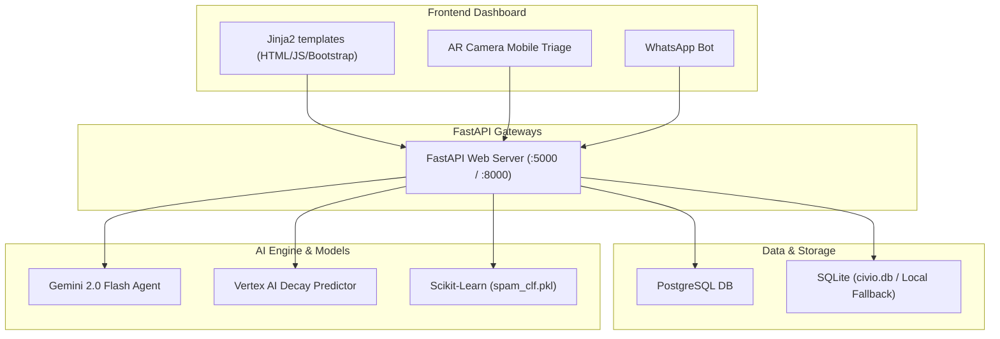

# 🏛️ Civio — The Self-Healing Civic Intelligence Platform

> **"Your city, self-healing & hyper-responsive."**  
> Welcome to the unified repository for **Civio**. This codebase combines predictive and agentic AI (Gemini 2.0 Flash) with a high-throughput spatial indexing and mapping dashboard (Leaflet UI) into a single, cohesive FastAPI-powered smart-city command center.

---

## 🌟 The Vision: Autonomous, Predictive, and Live

Civio resolves the major failure points of traditional citizen grievance portals—such as long forms, lack of spam validation, and manual dispatch queues—by implementing a fully automated self-healing civic workflow:

1. **AI vision triage:** Citizens capture an issue (e.g. a pothole), and Gemini 2.0 Flash automatically extracts category, details, estimated repair costs, and safety risks.
2. **Spam & Duplicate validation:** Submissions run through keyword lists, a locally trained Scikit-Learn classifier, and 64-bit image hashing (pHash) to filter out fake or nearby duplicate reports.
3. **Agentic Resolution Engine:** An autonomous Gemini reasoning loop verifies details, logs metadata, maps categories to administrative departments, schedules official work orders, and auto-dispatches alerts.
4. **Decay Forecasting:** Vertex AI patterns predict road and utility decay 30 days before citizen reports, enabling preventive maintenance.

---

## 🚀 Core Features

* **Interactive Command Center Map:** High-density Leaflet map showing active, resolved, and escalated reports, with live data filters.
* **Autonomous Resolution Loop:** A Python reasoning agent (`backend/agents/resolution_agent.py`) using tools to manage issues, schedule repair tasks, and update status.
* **Neighborhood Pulse Scan:** Walk a ward, auto-log anomalies, and earn citizen XP.
* **Budget Impact Simulator:** A visual CFO modeling tool displaying deferred maintenance costs over 1-to-12 months.
* **Accountability Index:** Ward-by-ward leaderboard comparing municipal departments on SLA performance.
* **Twilio WhatsApp Integration:** Outbound status alerts and inbound report triggers.

---

## 📁 Project Structure

```filepath
Civio/
├── backend/                        # Civio FastAPI Backend package
│   ├── main.py                     # Entry point & API Router config
│   ├── seed.py                     # Demo seeder for 300+ issues & users
│   ├── database/db.py              # Firestore / PostgreSQL / SQLite interfaces
│   ├── agents/                     # Gemini Triage & Autonomous Resolution loops
│   ├── routers/                    # Endpoint routers (issues, gamification, pulse scan, transparency, etc.)
│   │   └── legacy.py               # Handles Jinja2 HTML page views (Leaflet UI)
│   ├── templates/                  # Jinja2 HTML template views (Main dashboard, Gov console, etc.)
│   └── services/                   # Gemini, Vertex, Maps, and Spam validation modules
│
├── infra/                          # Deployment configurations
│   ├── Dockerfile                  # Container config (gunicorn/uvicorn on port 8000)
│   └── cloudbuild.yaml             # Google Cloud Build setup
│
├── requirements.txt                # Consolidated python dependencies (Render & Local)
└── .env.example                    # Template environment variables
```

---

## 🛠️ Unified Architecture Diagram



---

## 🚀 Setup & Execution Guide

### 1. Configure Environment Variables
Copy `.env.example` to `.env` in the root directory:
```bash
cp .env.example .env
```
Fill out the variables inside `.env`:
* **Required:** `GEMINI_API_KEY` (Get from Google AI Studio)
* **Optional:** `DATABASE_URL` (For cloud Postgres), `RESEND_API_KEY` (For email dispatch), `TWILIO_ACCOUNT_SID` (For WhatsApp).

*Note: If no database URL is set, the system automatically uses the local SQLite database.*

### 2. Install Dependencies
Install all required libraries locally:
```bash
pip install -r requirements.txt
```

### 3. Seed Database
Seed the database with 300+ mock issues, quests, and citizen accounts:
```bash
python backend/seed.py
```

### 4. Start the Application
Launch the FastAPI uvicorn server:
```bash
python backend/main.py
```
* The platform will be live at `http://localhost:5000/`.
* Interactive API Documentation will be live at `http://localhost:5000/docs`.
